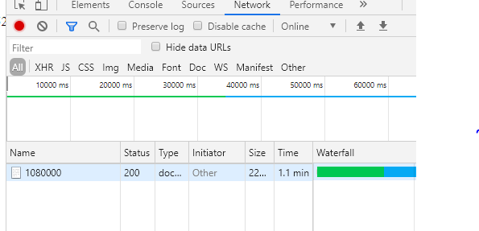
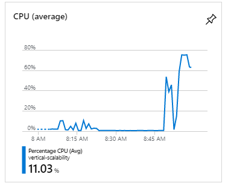
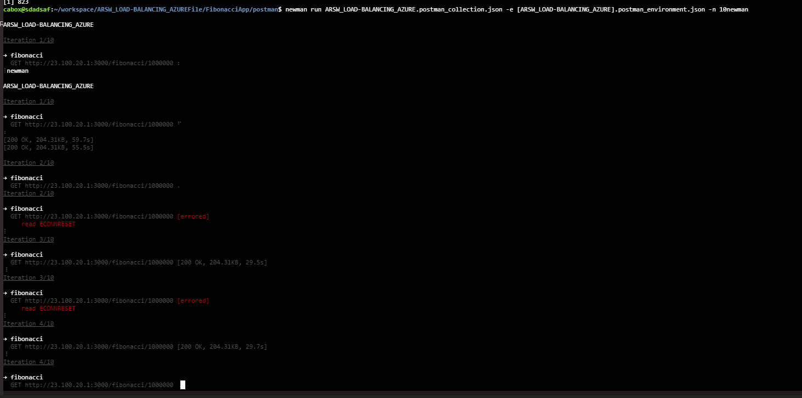
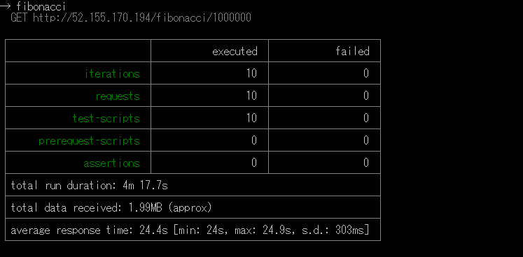
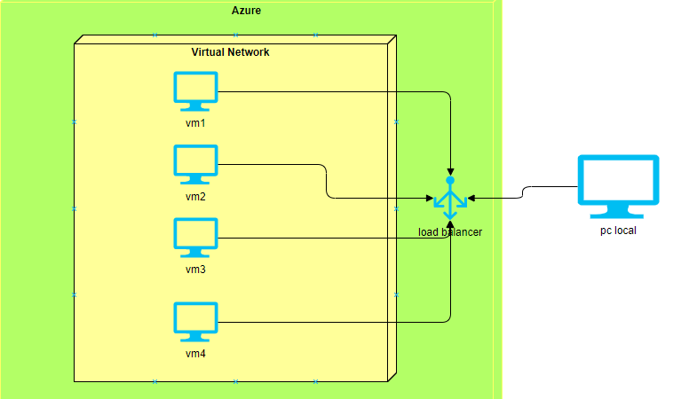

### Escuela Colombiana de Ingeniería

### Arquitecturas de Software - ARSW

## Escalamiento en Azure con Maquinas Virtuales, Sacale Sets y Service Plans

### Autores
   * Nicolas Patiño
   * Andres Rodriguez del toro
### Dependencias
* Cree una cuenta gratuita dentro de Azure. Para hacerlo puede guiarse de esta [documentación](https://azure.microsoft.com/en-us/free/search/?&ef_id=Cj0KCQiA2ITuBRDkARIsAMK9Q7MuvuTqIfK15LWfaM7bLL_QsBbC5XhJJezUbcfx-qAnfPjH568chTMaAkAsEALw_wcB:G:s&OCID=AID2000068_SEM_alOkB9ZE&MarinID=alOkB9ZE_368060503322_%2Bazure_b_c__79187603991_kwd-23159435208&lnkd=Google_Azure_Brand&dclid=CjgKEAiA2ITuBRDchty8lqPlzS4SJAC3x4k1mAxU7XNhWdOSESfffUnMNjLWcAIuikQnj3C4U8xRG_D_BwE). Al hacerlo usted contará con $200 USD para gastar durante 1 mes.

### Parte 0 - Entendiendo el escenario de calidad

Adjunto a este laboratorio usted podrá encontrar una aplicación totalmente desarrollada que tiene como objetivo calcular el enésimo valor de la secuencia de Fibonnaci.

**Escalabilidad**
Cuando un conjunto de usuarios consulta un enésimo número (superior a 1000000) de la secuencia de Fibonacci de forma concurrente y el sistema se encuentra bajo condiciones normales de operación, todas las peticiones deben ser respondidas y el consumo de CPU del sistema no puede superar el 70%.

### Parte 1 - Escalabilidad vertical

1. Diríjase a el [Portal de Azure](https://portal.azure.com/) y a continuación cree una maquina virtual con las características básicas descritas en la imágen 1 y que corresponden a las siguientes:
    * Resource Group = SCALABILITY_LAB
    * Virtual machine name = VERTICAL-SCALABILITY
    * Image = Ubuntu Server 
    * Size = Standard B1ls
    * Username = scalability_lab
    * SSH publi key = Su llave ssh publica


2. Para conectarse a la VM use el siguiente comando, donde las `x` las debe remplazar por la IP de su propia VM.

    `ssh scalability_lab@xxx.xxx.xxx.xxx`

3. Instale node, para ello siga la sección *Installing Node.js and npm using NVM* que encontrará en este [enlace](https://linuxize.com/post/how-to-install-node-js-on-ubuntu-18.04/).
4. Para instalar la aplicación adjunta al Laboratorio, suba la carpeta `FibonacciApp` a un repositorio al cual tenga acceso y ejecute estos comandos dentro de la VM:

    `git clone <your_repo>`

    `cd <your_repo>/FibonacciApp`

    `npm install`

5. Para ejecutar la aplicación puede usar el comando `npm FibinacciApp.js`, sin embargo una vez pierda la conexión ssh la aplicación dejará de funcionar. Para evitar ese compartamiento usaremos *forever*. Ejecute los siguientes comando dentro de la VM.

    `npm install forever -g`

    `forever start FibinacciApp.js`

6. Antes de verificar si el endpoint funciona, en Azure vaya a la sección de *Networking* y cree una *Inbound port rule* tal como se muestra en la imágen. Para verificar que la aplicación funciona, use un browser y user el endpoint `http://xxx.xxx.xxx.xxx:3000/fibonacci/6`. La respuesta debe ser `The answer is 8`.


7. La función que calcula en enésimo número de la secuencia de Fibonacci está muy mal construido y consume bastante CPU para obtener la respuesta. Usando la consola del Browser documente los tiempos de respuesta para dicho endpoint usando los siguintes valores:
    * 1000000
    * 1010000
    * 1020000
    * 1030000
    * 1040000
    * 1050000
    * 1060000
    * 1070000
    * 1080000
    * 1090000    

8. Dírijase ahora a Azure y verifique el consumo de CPU para la VM. (Los resultados pueden tardar 5 minutos en aparecer).


9. Ahora usaremos Postman para simular una carga concurrente a nuestro sistema. Siga estos pasos.
    * Instale newman con el comando `npm install newman -g`. Para conocer más de Newman consulte el siguiente [enlace](https://learning.getpostman.com/docs/postman/collection-runs/command-line-integration-with-newman/).
    * Diríjase hasta la ruta `FibonacciApp/postman` en una maquina diferente a la VM.
    * Para el archivo `[ARSW_LOAD-BALANCING_AZURE].postman_environment.json` cambie el valor del parámetro `VM1` para que coincida con la IP de su VM.
    * Ejecute el siguiente comando.

    ```
    newman run ARSW_LOAD-BALANCING_AZURE.postman_collection.json -e [ARSW_LOAD-BALANCING_AZURE].postman_environment.json -n 10 &
    newman run ARSW_LOAD-BALANCING_AZURE.postman_collection.json -e [ARSW_LOAD-BALANCING_AZURE].postman_environment.json -n 10
    ```

10. La cantidad de CPU consumida es bastante grande y un conjunto considerable de peticiones concurrentes pueden hacer fallar nuestro servicio. Para solucionarlo usaremos una estrategia de Escalamiento Vertical. En Azure diríjase a la sección *size* y a continuación seleccione el tamaño `B2ms`.


11. Una vez el cambio se vea reflejado, repita el paso 7, 8 y 9.
12. Evalue el escenario de calidad asociado al requerimiento no funcional de escalabilidad y concluya si usando este modelo de escalabilidad logramos cumplirlo.
13. Vuelva a dejar la VM en el tamaño inicial para evitar cobros adicionales.

**Preguntas**

1. ¿Cuántos y cuáles recursos crea Azure junto con la VM?

   Azure crea una IP pública, un grupo de red, una interfaz de red, un disco de almacenamiento_
2. ¿Brevemente describa para qué sirve cada recurso?

   *IP PUBLICA*  dirección IP para acceder a los servicios desplegados.
   *GRUPO DE RED*  controlar el acceso a los en la red privada de Azure generada con la maquina virtual.
   *INTERFAZ DE RED* Permite que la máquina virtual generada se comunique con los recursos de de la red.
   *DISCO DE ALMACENAMIENTO* Espacio de almacenamiento dispuesto para la maquina virtual generada.
   
3. ¿Al cerrar la conexión ssh con la VM, por qué se cae la aplicación que ejecutamos con el comando `npm FibonacciApp.js`? ¿Por qué debemos crear un *Inbound port rule* antes de acceder al servicio?

   cuando se establece una conexion ssh, se genera una instancia de aquello a lo que nos hayamos conectado, en este caso la maquina        virtual, si se cierra la conexion, esa instancia se termina igual que todas sus ejecuciones. Un *Inbound port rule* establece el        puerto de entrada del trafico de red, por lo que se define para que la maquina permita el ingreso de tráfico externo.
   
4. Adjunte tabla de tiempos e interprete por qué la función tarda tando tiempo.

   
   * 1000000 
   
   
   
   * 1010000  
   
   
   
   * 1020000
   
   
   
   * 1030000
   
   
   
   * 1040000
   
   
   
   * 1050000
   
   
   
   * 1060000
   
   
   
   * 1070000
   
   
   
   * 1080000
   
   
   
   * 1090000    
   
   
   
  Para realizar el calculo de cada valor siempre itera y recalcula el valor, podria ser mas eficiente si no tuviera que recalcular los     mismos valores cada vez.

5. Adjunte imágen del consumo de CPU de la VM e interprete por qué la función consume esa cantidad de CPU.

    
    
    No se divide la carga de cada peticion.
    
6. Adjunte la imagen del resumen de la ejecución de Postman. Interprete:
    * Tiempos de ejecución de cada petición.
    * Si hubo fallos documentelos y explique.
    
    
    
7. ¿Cuál es la diferencia entre los tamaños `B2ms` y `B1ls` (no solo busque especificaciones de infraestructura)?

   La  escalablidad que cada una presenta frente a la variacion en el volumen de datos y su manipulacion variando en cada una el            rendimiento que puede ofrecer.
   
8. ¿Aumentar el tamaño de la VM es una buena solución en este escenario?, ¿Qué pasa con la FibonacciApp cuando cambiamos el tamaño de la VM?
   el tiempo de ejecución es el mismo, ya que la implementación  no hace uso de los nuevos recursos , aunque el consumo de cpu puede        reducirse y aumenta la disponibilidad para un mayor volumen de datos.
   
9. ¿Qué pasa con la infraestructura cuando cambia el tamaño de la VM? ¿Qué efectos negativos implica?

   se pierde disponibilidad mientras el cambio del tamaño de la VM, incrementa costos, se pierde informacion de la memoria volatil.

10. ¿Hubo mejora en el consumo de CPU o en los tiempos de respuesta? Si/No ¿Por qué?

   El tiempo de ejecucion es el mismo, no se hace uso del nuevo recurso por lo que la mejora es leve respecto al rendimiento de la cpu.
   
11. Aumente la cantidad de ejecuciones paralelas del comando de postman a `4`. ¿El comportamiento del sistema es porcentualmente mejor?

### Parte 2 - Escalabilidad horizontal

#### Crear el Balanceador de Carga

Antes de continuar puede eliminar el grupo de recursos anterior para evitar gastos adicionales y realizar la actividad en un grupo de recursos totalmente limpio.

1. El Balanceador de Carga es un recurso fundamental para habilitar la escalabilidad horizontal de nuestro sistema, por eso en este paso cree un balanceador de carga dentro de Azure tal cual como se muestra en la imágen adjunta.


2. A continuación cree un *Backend Pool*, guiese con la siguiente imágen.


3. A continuación cree un *Health Probe*, guiese con la siguiente imágen.


4. A continuación cree un *Load Balancing Rule*, guiese con la siguiente imágen.


5. Cree una *Virtual Network* dentro del grupo de recursos, guiese con la siguiente imágen.


#### Crear las maquinas virtuales (Nodos)

Ahora vamos a crear 3 VMs (VM1, VM2 y VM3) con direcciones IP públicas standar en 3 diferentes zonas de disponibilidad. Después las agregaremos al balanceador de carga.

1. En la configuración básica de la VM guíese por la siguiente imágen. Es importante que se fije en la "Avaiability Zone", donde la VM1 será 1, la VM2 será 2 y la VM3 será 3.


2. En la configuración de networking, verifique que se ha seleccionado la *Virtual Network*  y la *Subnet* creadas anteriormente. Adicionalmente asigne una IP pública y no olvide habilitar la redundancia de zona.


3. Para el Network Security Group seleccione "avanzado" y realice la siguiente configuración. No olvide crear un *Inbound Rule*, en el cual habilite el tráfico por el puerto 3000. Cuando cree la VM2 y la VM3, no necesita volver a crear el *Network Security Group*, sino que puede seleccionar el anteriormente creado.


4. Ahora asignaremos esta VM a nuestro balanceador de carga, para ello siga la configuración de la siguiente imágen.


5. Finalmente debemos instalar la aplicación de Fibonacci en la VM. para ello puede ejecutar el conjunto de los siguientes comandos, cambiando el nombre de la VM por el correcto

```
git clone https://github.com/daprieto1/ARSW_LOAD-BALANCING_AZURE.git

curl -o- https://raw.githubusercontent.com/creationix/nvm/v0.34.0/install.sh | bash
source /home/vm1/.bashrc
nvm install node

cd ARSW_LOAD-BALANCING_AZURE/FibonacciApp
npm install

npm install forever -g
forever start FibonacciApp.js
```

Realice este proceso para las 3 VMs, por ahora lo haremos a mano una por una, sin embargo es importante que usted sepa que existen herramientas para aumatizar este proceso, entre ellas encontramos Azure Resource Manager, OsDisk Images, Terraform con Vagrant y Paker, Puppet, Ansible entre otras.

#### Probar el resultado final de nuestra infraestructura

1. Porsupuesto el endpoint de acceso a nuestro sistema será la IP pública del balanceador de carga, primero verifiquemos que los servicios básicos están funcionando, consuma los siguientes recursos:

```
http://52.155.223.248/
http://52.155.223.248/fibonacci/1
```

2. Realice las pruebas de carga con `newman` que se realizaron en la parte 1 y haga un informe comparativo donde contraste: tiempos de respuesta, cantidad de peticiones respondidas con éxito, costos de las 2 infraestrucruras, es decir, la que desarrollamos con balanceo de carga horizontal y la que se hizo con una maquina virtual escalada.

3. Agregue una 4 maquina virtual y realice las pruebas de newman, pero esta vez no lance 2 peticiones en paralelo, sino que incrementelo a 4. Haga un informe donde presente el comportamiento de la CPU de las 4 VM y explique porque la tasa de éxito de las peticiones aumento con este estilo de escalabilidad.

```
newman run ARSW_LOAD-BALANCING_AZURE.postman_collection.json -e [ARSW_LOAD-BALANCING_AZURE].postman_environment.json -n 10 &
newman run ARSW_LOAD-BALANCING_AZURE.postman_collection.json -e [ARSW_LOAD-BALANCING_AZURE].postman_environment.json -n 10 &
newman run ARSW_LOAD-BALANCING_AZURE.postman_collection.json -e [ARSW_LOAD-BALANCING_AZURE].postman_environment.json -n 10 &
newman run ARSW_LOAD-BALANCING_AZURE.postman_collection.json -e [ARSW_LOAD-BALANCING_AZURE].postman_environment.json -n 10
```

**Preguntas**

* ¿Cuáles son los tipos de balanceadores de carga en Azure y en qué se diferencian?, ¿Qué es SKU, qué tipos hay y en qué se diferencian?, ¿Por qué el balanceador de carga necesita una IP pública?
   un balanceador de cargas permite que las aplicaciones escalen y permite crear una        alta disponibilidad para los servicios expuestos proporciona baja latencia y alto rendimiento. 
   
  
|  | SKU Estándar | SKU Básico |
|:----------------------------------------------------------:|:------------------------------------------------------------------------------------------------------------------------------------------------------------------------------------------------------------------------------------------------------------------------------------------------------------------------------------------------------------------------------------------------------------------------------------------------------------------------------------------------------------------------------------------------------------------------------------------------------------------------------------------------------------------------------------------------------------------------------------------------------------------------------------------------------------------------------------------------------------------------------------------------------------------------------------------------------------------------------------------------------------------------------------------------------------------------------------------------------------------------------------------------------------------------------------------------------:|:------------------------------------------------------------------------------------------------------------------------------------------------------------------------------------------------------------------------------------------------------------------:|
| Tamaño de grupo de back-end | Admite hasta 1000 instancias. | Admite hasta 100 instancias. |
| Puntos de conexión del grupo de back-end | Cualquier máquina virtual en una única red virtual, lo que incluye la combinación de máquinas virtuales, conjuntos de disponibilidad y grupos de escalado de máquinas virtuales. | Máquinas virtuales en un único conjunto de disponibilidad o conjunto de escalado de máquinas virtuales. |
| Sondeos de mantenimiento | TCP, HTTP, HTTPS | TCP, HTTP |
| Comportamiento del sondeo de mantenimiento | Las conexiones TCP permanecen activas en el sondeo de la instancia y en todos los sondeos | Las conexiones TCP permanecen activas en el sondeo de la instancia. Todas las conexiones TCP finalizan en todos los sondeos. |
| Zonas de disponibilidad | En SKU de nivel Estándar, front-end zonales y con redundancia de zona para la entrada y la salida, asignaciones de flujos de salida, supervivencia a errores de zona, equilibrio de carga entre zonas. | No disponible. |
| Diagnóstico | Azure Monitor, métricas multidimensionales, incluidos bytes y contadores de paquetes, estado de sondeo de mantenimiento, intentos de conexión (TCP SYN), mantenimiento de la conexión de salida (flujos SNAT correctos e incorrectos), medidas de planos de datos activos. | Azure Log Analytics solo para Load Balancer público, alerta de agotamiento de SNAT, recuento de mantenimientos del grupo back-end. |
| Puertos HA | Equilibrador de carga interno | No disponible. |
| Seguro de forma predeterminada | La dirección IP pública, los puntos de conexión de Load Balancer y los puntos de conexión de Load Balancer interno están cerca de los flujos de entrada a menos que el grupo de seguridad de red los incluya en la lista de permitidos. | Abierta de forma predeterminada, grupo de seguridad de red opcional. |
| Conexiones salientes | Puede definir explícitamente un protocolo NAT de salida basado en grupos con reglas de salida. Puede utilizar varios front-end con la deshabilitación de envíos en cada regla de equilibrio de carga. Para usar la conectividad de salida, debe crearse explícitamente un escenario de salida para la máquina virtual, el conjunto de disponibilidad y el conjunto de escalado de máquinas virtuales. Los puntos de conexión de servicio de red virtual son accesibles sin conectividad de salida y no se cuentan como datos procesados. Las direcciones IP públicas, incluidos los servicios de PaaS de Azure que no están disponibles como puntos de conexión de servicio de red virtual, deben ser accesibles mediante conectividad de salida y cuentan como datos procesados. Si solo hay una instancia de Load Balancer interno que atiende una máquina virtual, un conjunto de disponibilidad o un conjunto de escalado de máquinas virtuales, no habrá conexiones de salida disponibles mediante el protocolo SNAT predeterminado; use en su lugar reglas de salida. La programación de SNAT de salida es específica del protocolo de transporte de la regla de equilibrio de carga de entrada. | Único front-end, seleccionado de forma aleatoria, cuando hay varios front-ends. Cuando solo Load Balancer interno atiende una máquina virtual, un conjunto de disponibilidad o un conjunto de escalado de máquinas virtuales, se usa SNAT de forma predeterminada. |
| Reglas de salida | Configuración declarativa del protocolo NAT de salida, con las direcciones IP públicas o los prefijos de IP pública, o ambos, el tiempo de espera de inactividad de salida (4-120 minutos) y la asignación de puertos de SNAT personalizados | No disponible. |
| Restablecimiento de TCP en tiempo de espera de inactividad | Habilite en cualquier regla el restablecimiento de TCP (TCP RST) en tiempo de espera de inactividad. | No disponible |
| Varios servidores front-end | Entrada y salida | Solo de entrada |
| Operaciones de administración | La mayoría de las operaciones en menos de 30 segundos | Normalmente, entre 60 y 90 segundos. |
| Contrato de nivel de servicio | 99,99 % para la ruta de acceso a los datos con dos máquinas virtuales correctas. | No aplicable. |
| Precios | Se cobra según el número de reglas y los datos procesados de entrada y salida asociados con el recurso. | Sin cargo. |

* ¿Cuál es el propósito del *Backend Pool*?
  grupo de instancias del balanceador de carga que se encarga de recibir el tráfico similar de la aplicación.

* ¿Cuál es el propósito del *Health Probe*?
   envía solicitudes periódicas de sondeo HTTP / HTTPS a cada uno de los backends configurados. Las solicitudes de sondeo determinan la   proximidad y el estado de cada back-end para equilibrar la carga de sus solicitudes de usuario final. 
   
* ¿Cuál es el propósito de la *Load Balancing Rule*? ¿Qué tipos de sesión persistente existen, por qué esto es importante y cómo puede afectar la escalabilidad del sistema?.
   para distribuir el tráfico que llega al front-end a las instancias de grupo de back-end
   
* ¿Qué es una *Virtual Network*? ¿Qué es una *Subnet*? ¿Para qué sirven los *address space* y *address range*?
   *Virtual Network* un centro de datos o red de proveedores de servicios proporcione la estructura de red más adecuada y eficiente para     las aplicaciones    que aloja utlizando software en vez de requerir de conexiones hardware.
   
   *address space y address range* es un rango de direcciones válidas en la memoria que están disponibles para un programa o proceso, La     memoria puede ser física o virtual y se utiliza para ejecutar instrucciones y almacenar datos.
   
* ¿Qué son las *Availability Zone* y por qué seleccionamos 3 diferentes zonas?. ¿Qué significa que una IP sea *zone-redundant*?
   Son ubicaciones aisladas dentro de las regiones del centro de datos desde donde se originan y operan los servicios de nube pública
   zone-redundat significa que se podra acceder y administrar los datos en caso de que una zona no este disponible.
* ¿Cuál es el propósito del *Network Security Group*?
   filtrar el tráfico de red hacia y desde los recursos de en una red virtual.
* Informe de newman 1 (Punto 2)

 
 
  

* Presente el Diagrama de Despliegue de la solución.

 


